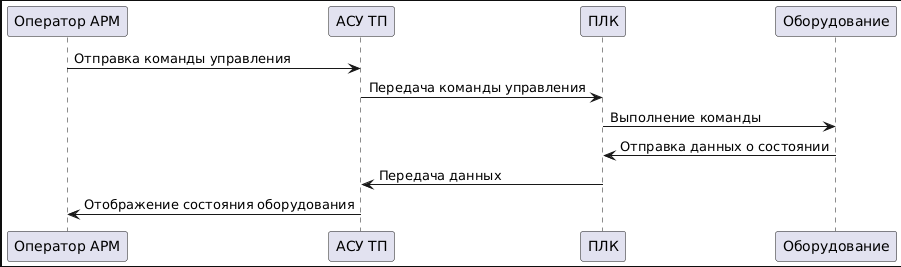
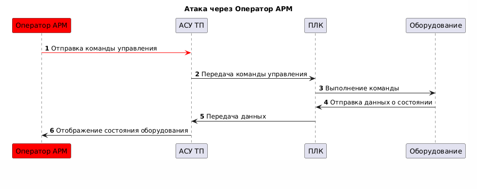

# Автоматизированная система управления (АСУ) ТЭЦ

## Краткое описание проектируемой системы

Продукт - программируемый логический контроплер, обеспечивающий взаимодействие автоматизированной системы управления технологическим процессом (АСУ ТП) с конечным оборудованием.

Автоматизированная система управления (АСУ) ТЭЦ обрабатывает сигналы от оборудования, управляет им по правилам, с параметрами, уникальными для каждой станции, через
программируемые погические контроплеры (ПЛК), связанные с оборудованием, или датчики, передавая в АСУ данные, а команды от АСУ - в исполнительные устройства.

Контроллер выполняет управление техн. оборудованием по прикладной программе, написанной инженером-разработчиком.
Прикладная программа работает поверх системного ПО. Для обеспечения необходимой гибкости наладки и реализации технических процессов прикладная программа может
свободно меняться квалифицированным персоналом без необходимости изменения системного ПО.

## Ключевые ценности, ущербы, неприемлемые события

| Ценность | Нежелательные события | Комментарий |
|----------|-----------------------|-------------|
| Данные, которые получает и передаёт ПЛК | Нарушение целостности (сигнал изменён) | Включает: - сырые данные - результат обработки данных на стороне ЛК |
|  | Нарушение достоверности сигнала  | |
|  | Сигнал не обработан (пришёл и пропал) |  |
|  | Нарушение доступности|    |
| Команды для оборудования | Команды нет, когда нужно | Первое - это доступность | 
| | Команда есть, когда не нужно | |
| Прикладная программа (ПП) инженера-разработчика | Использована неаутентичная ПП | Утечка кода ПП в сеть
|| Неавторизованный доступ к коду ПП | |
| Лицензия на режимы работы ПП | Использование неаутентичной лицензии | Формат и способ генерации лицензии на выбор команд|
| | Неавторизованный доступ к данным лицензии | |

## Роли пользователей

| Роль | Назначение | Комментарий |
|----------|-----------------------|-------------|
| Оператор АРМ | Пользуется данными ПЛК. Отправляет сигналы на оборудование. Может менять уставки (донастраивать ПП) | |
| Инженер по автоматизации | Может изменить ПП и обновить его на ПЛК | При наличии лицензии |
| Наблюдатель | Имеет доступ к данным мониторинга в режиме только для чтения | |

## Основные функциональные сценарии

## Цели и предположения безопасности

#### Цели безопасности
Непрерывная работа инфрастуктуры.

#### Предположения безопасности
Обеспечить физическую безопасность оборудования. Провести аудит безопасности прикладного приложения.

## Негативные сценарии

Рассмотрим сценарий, когда место оператора АРМ было захвачено и отправляется нелегитимная команда

