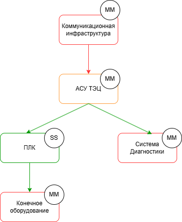
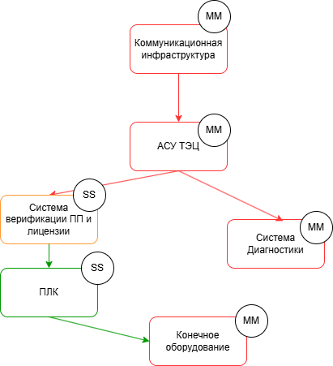

# Автоматизированная система управления (АСУ) ТЭЦ

## Краткое описание проектируемой системы

Продукт - программируемый логический контроплер, обеспечивающий взаимодействие автоматизированной системы управления технологическим процессом (АСУ ТП) с конечным оборудованием.

Автоматизированная система управления (АСУ) ТЭЦ обрабатывает сигналы от оборудования, управляет им по правилам, с параметрами, уникальными для каждой станции, через
программируемые погические контроплеры (ПЛК), связанные с оборудованием, или датчики, передавая в АСУ данные, а команды от АСУ - в исполнительные устройства.

Контроллер выполняет управление техн. оборудованием по прикладной программе, написанной инженером-разработчиком.
Прикладная программа работает поверх системного ПО. Для обеспечения необходимой гибкости наладки и реализации технических процессов прикладная программа может
свободно меняться квалифицированным персоналом без необходимости изменения системного ПО.

## Ключевые ценности, ущербы, неприемлемые события

| Ценность | Нежелательные события | Комментарий |
|----------|-----------------------|-------------|
| Данные, которые получает и передаёт ПЛК | Нарушение целостности (сигнал изменён) | Включает: - сырые данные - результат обработки данных на стороне ЛК |
|  | Нарушение достоверности сигнала  | |
|  | Сигнал не обработан (пришёл и пропал) |  |
|  | Нарушение доступности|    |
| Команды для оборудования | Команды нет, когда нужно | Первое - это доступность | 
| | Команда есть, когда не нужно | |
| Прикладная программа (ПП) инженера-разработчика | Использована неаутентичная ПП | Утечка кода ПП в сеть
|| Неавторизованный доступ к коду ПП | |
| Лицензия на режимы работы ПП | Использование неаутентичной лицензии | Формат и способ генерации лицензии на выбор команд|
| | Неавторизованный доступ к данным лицензии | |

## Роли пользователей

| Роль | Назначение | Комментарий |
|----------|-----------------------|-------------|
| Оператор АРМ | Пользуется данными ПЛК. Отправляет сигналы на оборудование. Может менять уставки (донастраивать ПП) | |
| Инженер по автоматизации | Может изменить ПП и обновить его на ПЛК | При наличии лицензии |
| Наблюдатель | Имеет доступ к данным мониторинга в режиме только для чтения | |

## Контекст

## Основные функциональные сценарии

## Высокоуровневая архитектура

## Описание подсистем
|Название подсистемы |Назначение
|----------|-----------------------|
|Коммуникационная инфраструктураавляет сигналы на оборудование. Может менять уставки (донастраивать ПП) |Обеспечивает безопасную и надёжную передачу данных между АСУ ТП и внешними системами.
| АСУ ТЭЦ|Обрабатывает управляющие сигналы, формирует команды, взаимодействует с ПЛК и диагностикой.
| ПЛК | Центр локального управления. Выполняет команды, собирает данные, выполняет прикладную программу
Система диагностики | Контролирует целостность сигналов, версию ПП, статус лицензии, состояние оборудования.
Конечное оборудование | Физические устройства (насосы, клапаны, датчики и т.п.), управляющиеся ПЛК.
## Расширенные диаграммы функциональных сценариев

## Цели и предположения безопасности

#### Цели безопасности
1.Непрерывная работа инфрастуктуры.

#### Предположения безопасности
Обеспечить физическую безопасность оборудования. Провести аудит безопасности прикладного приложения.
### Таблица соотнесения ценностей, неприемлемых событий и целей безопасности
| Ценность |Негативные собитие | Оценка учерба | Цель безопасности
|----------|-----------------------|-------------|-------|
| Данные, которые получает и передаёт ПЛК | Нарушение целостности (сигнал изменён) |Высокий | 1|
|  | Нарушение достоверности сигнала |Средний | 1
|  | Сигнал не обработан (пришёл и пропал) |Высокий | 1|
|  | Нарушение доступности|Высокий | 1|
| Команды для оборудования | Команды нет, когда нужно |Высокий | 1|
| | Команда есть, когда не нужно |Средний | -|
| Прикладная программа (ПП) инженера-разработчика | Использована неаутентичная ПП |Средний | -|
|| Неавторизованный доступ к коду ПП |Высокий | -|
| Лицензия на режимы работы ПП | Использование неаутентичной лицензии |Средний | -|
| | Неавторизованный доступ к данным лицензии |Средний | -|
## Негативные сценарии

 ## Политика Архитектуры
 #### Версия 1
 
 |Домен безопасности | Уровень доверия|Оценка сложности и размера домена| Обоснование
|--------|----------|-----------------------|-------------|
| Коммуникационная инфраструктура| Недоверенный|MM|Передаёт команды и данные, может быть скомпрометирован, ЦБ защищается ПЛК |
| АСУ ТЭЦ|Доверенный, повышающий целостность данныховеренный|MM|Центр логики и контроля; проверяет входящие сигналы, повышая доверие.|
| ПЛК| 	Доверенный| SS| Простая структура, малая по объёму, но выполняет критические функции
| Система диагностики |Недоверенный |MM| Только мониторинг; при компрометации влияет только на скорость реакции|
|  Конечное оборудование|Недоверенный |MM | Могут быть неисправности, но ответственность за достоверность лежит на ПЛК.

 #### Версия 2
 
 |Домен безопасности | Уровень доверия|Оценка сложности и размера домена| Обоснование
|--------|----------|-----------------------|-------------|
| Коммуникационная инфраструктура| Недоверенный|MM|Риски компрометации купируются на уровне ПЛК и верификации ПП
| АСУ ТЭЦ|Недоверенный|MM|При ошибках или атаках компенсируется проверкой ПП|
| Система верификации ПП и лицензий|Доверенный, повышающий целостность данныховеренный|SS| аленькая, точечная по функциям, но обеспечивает доверие ко всему процессу|
| ПЛК| 	Доверенный| SS| Критичная, но простая структура, основа управления|
| Система диагностики |Недоверенный |MM|Не влияет на выполнение ПП, не нарушает ЦБ напрямую|
|  Конечное оборудование|Недоверенный |MM | Могут быть неисправности, но ответственность за достоверность лежит на ПЛК.
