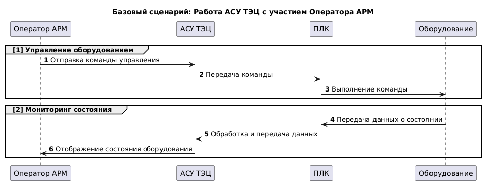
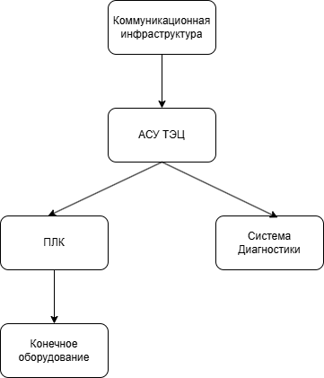
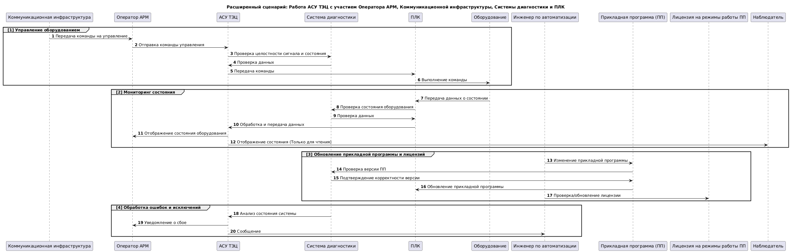
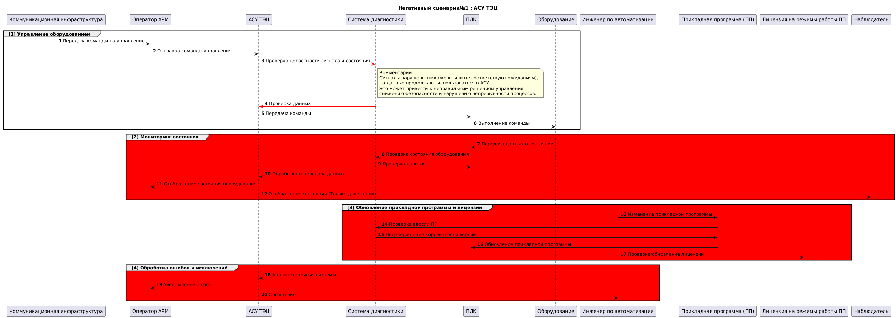
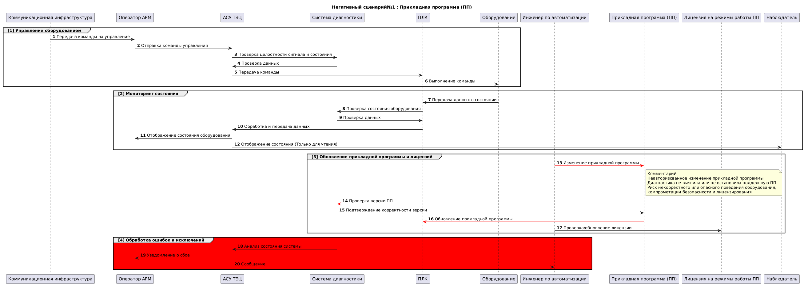
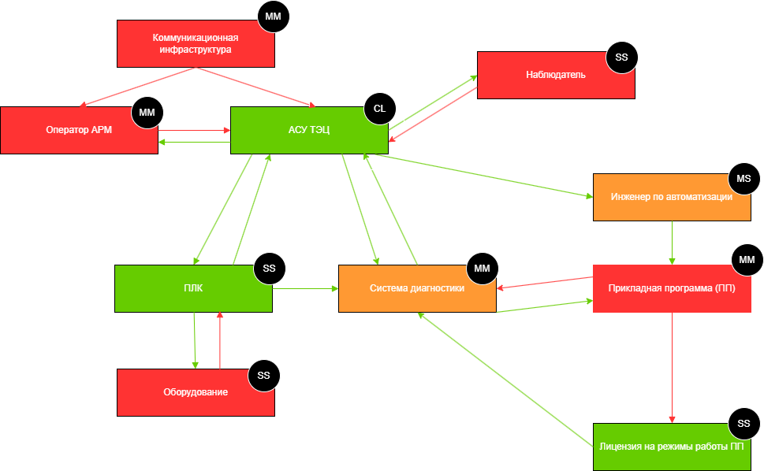
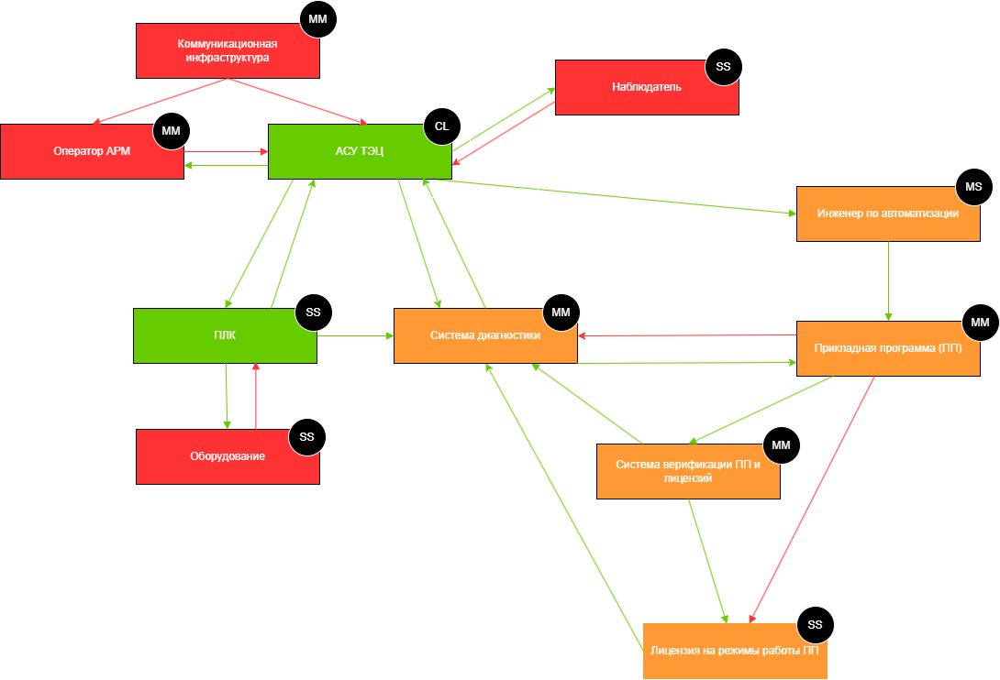
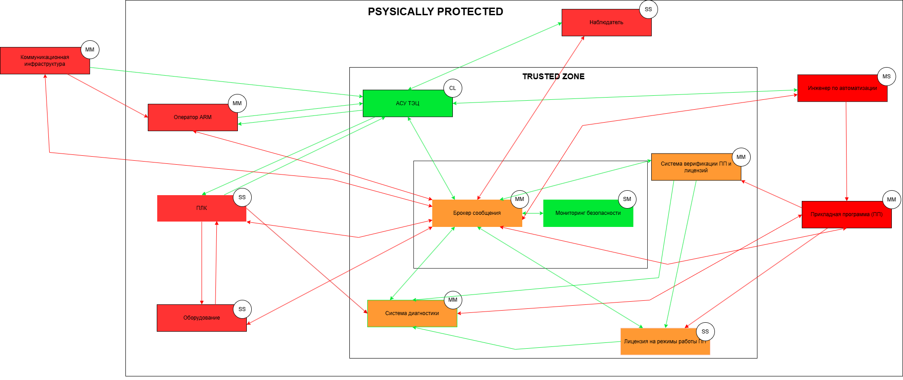

# Автоматизированная система управления (АСУ) ТЭЦ

## Краткое описание проектируемой системы

Продукт - программируемый логический контроплер, обеспечивающий взаимодействие автоматизированной системы управления технологическим процессом (АСУ ТП) с конечным оборудованием.

Автоматизированная система управления (АСУ) ТЭЦ обрабатывает сигналы от оборудования, управляет им по правилам, с параметрами, уникальными для каждой станции, через
программируемые погические контроплеры (ПЛК), связанные с оборудованием, или датчики, передавая в АСУ данные, а команды от АСУ - в исполнительные устройства.

Контроллер выполняет управление техн. оборудованием по прикладной программе, написанной инженером-разработчиком.
Прикладная программа работает поверх системного ПО. Для обеспечения необходимой гибкости наладки и реализации технических процессов прикладная программа может
свободно меняться квалифицированным персоналом без необходимости изменения системного ПО.

## Ключевые ценности, ущербы, неприемлемые события

| Ценность | Нежелательные события | Комментарий |
|----------|-----------------------|-------------|
| Данные, которые получает и передаёт ПЛК | Нарушение целостности (сигнал изменён) | Включает: - сырые данные - результат обработки данных на стороне ЛК |
|  | Нарушение достоверности сигнала  | |
|  | Сигнал не обработан (пришёл и пропал) |  |
|  | Нарушение доступности|    |
| Команды для оборудования | Команды нет, когда нужно | Первое - это доступность | 
| | Команда есть, когда не нужно | |
| Прикладная программа (ПП) инженера-разработчика | Использована неаутентичная ПП | Утечка кода ПП в сеть
|| Неавторизованный доступ к коду ПП | |
| Лицензия на режимы работы ПП | Использование неаутентичной лицензии | Формат и способ генерации лицензии на выбор команд|
| | Неавторизованный доступ к данным лицензии | |

## Роли пользователей

| Роль | Назначение | Комментарий |
|----------|-----------------------|-------------|
| Оператор АРМ | Пользуется данными ПЛК. Отправляет сигналы на оборудование. Может менять уставки (донастраивать ПП) | |
| Инженер по автоматизации | Может изменить ПП и обновить его на ПЛК | При наличии лицензии |
| Наблюдатель | Имеет доступ к данным мониторинга в режиме только для чтения | |

## Контекст

## Основные функциональные сценарии

## Высокоуровневая архитектура

## Описание подсистем
|Название подсистемы |Назначение
|----------|-----------------------|
|Коммуникационная инфраструктураавляет сигналы на оборудование. Может менять уставки (донастраивать ПП) |Обеспечивает безопасную и надёжную передачу данных между АСУ ТП и внешними системами.
| АСУ ТЭЦ|Обрабатывает управляющие сигналы, формирует команды, взаимодействует с ПЛК и диагностикой.
| ПЛК | Центр локального управления. Выполняет команды, собирает данные, выполняет прикладную программу
Система диагностики | Контролирует целостность сигналов, версию ПП, статус лицензии, состояние оборудования.
Конечное оборудование | Физические устройства (насосы, клапаны, датчики и т.п.), управляющиеся ПЛК.
## Расширенные диаграммы функциональных сценариев

## Цели и предположения безопасности

#### Цели безопасности
1. Прикладная программа (ПП) и лицензии на её режимы работы могут быть изменены только авторизованным персоналом с использованием доверенных средств и подтверждением подлинности.
2. Команды от АСУ к исполнительному оборудованию не принимаются, если они поступили от неаутентифицированного источника или были подменены в процессе передачи.
3. Данные, поступающие от датчиков и оборудования в ПЛК, не используются системой, если их целостность или источник не могут быть подтверждены.
4. ПЛК принимает команды управления только от доверенных источников, по определённым маршрутам, в допустимом временном окне, с проверкой целостности и актуальности.
5. Доступ к данным прикладной программы и лицензии возможен только с использованием предопределённых доверенных средств и идентифицированных ролей.

#### Предположения безопасности
1. Потенциальный злоумышленник не имеет физического доступа к ПЛК, сетевым интерфейсам и инженерным портам.
2. Все пользователи, обладающие правом изменять прикладную программу, проходят строгую идентификацию и действуют в рамках выданных ролей.
3. Сетевое окружение системы функционирует в условиях контролируемой изоляции от внешних сетей, за исключением проверенных каналов.
4. Все управляющие команды поступают только по известным каналам и в допустимом контексте исполнения.
5. Редактирование прикладной программы и лицензий возможно только с доверенных инженерных рабочих станций, находящихся в защищённой сети.
### Таблица соотнесения ценностей, неприемлемых событий и целей безопасности
| Ценность |Негативные собитие | Оценка учерба | Цель безопасности
|----------|-----------------------|-------------|-------|
| Данные, которые получает и передаёт ПЛК | Нарушение целостности (сигнал изменён) |Высокий | 3|
|  | Нарушение достоверности сигнала |Средний | 3
|  | Сигнал не обработан (пришёл и пропал) |Высокий | 4|
|  | Нарушение доступности|Высокий | 4|
| Команды для оборудования | Команды нет, когда нужно |Высокий | 4|
| | Команда есть, когда не нужно |Средний | 2|
| Прикладная программа (ПП) инженера-разработчика | Использована неаутентичная ПП |Средний | 1|
|| Неавторизованный доступ к коду ПП |Высокий | 5|
| Лицензия на режимы работы ПП | Использование неаутентичной лицензии |Средний | 1|
| | Неавторизованный доступ к данным лицензии |Средний | 5|
## Негативные сценарии

 ## Политика Архитектуры
 #### Версия 1
 
 |Домен безопасности | Уровень доверия|Оценка сложности и размера домена| Обоснование
|--------|----------|-----------------------|-------------|
| Коммуникационная инфраструктура| Недоверенный|MM|Передаёт команды и данные, может быть скомпрометирован, ЦБ защищается ПЛК |
| АСУ ТЭЦ|Доверенный|CL|Центр логики и контроля; проверяет входящие сигналы, повышая доверие.|
| ПЛК| 	Доверенный|SS| Собственная разработка, известная архитектура, ограниченный функционал, физически защищён
| Система диагностики |Доверенный, повышающая целостность |MM| Выполняет контроль, сложно подделать, не влияет напрямую на управление|
|Оборудование|Недоверенный |SS | Могут быть неисправности, но ответственность за достоверность лежит на ПЛК.
|Инженер по автоматизации|Доверенный, повышающая целостность |MS|	Использует специализированные инструменты, но возможны ошибки конфигурации
|Прикладная программа (ПП)|Недоверенный|MM |	Получена извне, изменяема, нет механизмов контроля подлинности
|Лицензия на режимы ПП|Доверенный|SS |Простая реализация, проверяет режимы, но пока без криптографической верификации
|Оператор АРМ|Недоверенный|MM |	Управляется человеком, возможны ошибки или саботаж
|Наблюдатель|Недоверенный|SS|	Только читает данные, не проверяется на подлинность, возможна подмена

 #### Версия 2
 
 |Домен безопасности | Уровень доверия|Оценка сложности и размера домена| Обоснование
|--------|----------|-----------------------|-------------|
| Коммуникационная инфраструктура| Недоверенный|MM|Передаёт команды и данные, может быть скомпрометирован, ЦБ защищается ПЛК |
| АСУ ТЭЦ|Доверенный|CL|Центр логики и контроля; проверяет входящие сигналы, повышая доверие.|
| ПЛК| 	Доверенный|SS| Собственная разработка, известная архитектура, ограниченный функционал, физически защищён
| Система диагностики |Доверенный, повышающая целостность |MM| Выполняет контроль, сложно подделать, не влияет напрямую на управление|
|Оборудование|Недоверенный |SS | Могут быть неисправности, но ответственность за достоверность лежит на ПЛК.
|Инженер по автоматизации|Доверенный, повышающая целостность |MS|	Использует специализированные инструменты, но возможны ошибки конфигурации
|Прикладная программа (ПП)|Доверенный, повышающая целостность|MM |	Проходит верификацию на ПЛК, защищена от внедрения вредоносного кода
|Лицензия на режимы ПП|Доверенный, повышающая целостность|SS |Верифицируется системой, невозможно подделать без криптографического ключа
|Оператор АРМ|Недоверенный|MM |	Управляется человеком, возможны ошибки или саботаж
|Наблюдатель|Недоверенный|SS|	Только читает данные, не проверяется на подлинность, возможна подмена
|Система верификации ПП и лицензий| Доверенный, повышающая целостность|MM|	Проверяет подлинность ПО и лицензий с использованием криптографии, исключает подмену, устойчива к атаке

 ## Политика Архитектуры 2
 ####  broker  и monitor
  

#### Реализованная политика безопасности в коде
    import base64

    VERIFIER_SEAL = "verifier_seal"
    LICENSE_SIGNATURE = "license_signature"

    def check_operation(id, details):
        authorized = False

        src = details["source"]
        dst = details["destination"]
        operation = details["operation"]

        if dst == 'comm_infra':
            authorized = True

        # Коммуникационная инфраструктура может отправлять данные брокеру
        if src == 'comm_infra' and dst == 'message_broker':
            authorized = True

        # Брокер может отправить данные обратно в коммуникационную инфраструктуру
        if src == 'message_broker' and dst == 'comm_infra':
            authorized = True

        # Коммуникационная инфраструктура может передать данные АСУ ТЭЦ
        if src == 'comm_infra' and dst == 'asu_teс':
            authorized = True
            # Коммуникационная инфраструктура может передать данные Оператору ARM
        if src == 'comm_infra' and dst == 'operator_arm':
            authorized = True

        if src == 'operator_arm' and dst == 'message_broker' : 
            authorized = True 
        if src == 'message_broker' and dst == 'operator_arm' : 
            authorized = True 

        if src == 'message_broker' and dst == 'asu_teс' \
                and operation == 'control_command_from_operator':
            authorized = True  # Команда оператора на управление

        if src == 'asu_teс' and dst == 'message_broker' : 
            authorized = True

        if src == 'operator_arm' and dst == 'asu_teс':
            authorized = True
        
        if src == 'asu_teс' and dst == 'plc' \
                and operation == 'validated_command_from_asu':
            authorized = True

        if src == 'plc' and dst == 'pmessage_broker' :
            authorized = True

        if src == 'message_broker' and dst == 'plc' :
            authorized = True
            

        # ПЛК управляет оборудованием 
        if src == 'plc' and dst == 'equipment' \
                and operation == 'execute_command':
            authorized = True

        if src == 'equipment' and dst == 'message_broker': 
            authorized = True
        if src == 'message_broker' and dst == 'equipment': 
            authorized = True

        # Оборудование отправляет статус ПЛК 
        if src == 'equipmen' and dst == 'plc' \
                and operation == 'equipment_status_update':
            authorized = True

        # ПЛК отправляет статус АСУ ТЭЦ
        if src == 'plc' and dst == 'asu_teс' \
                and operation == 'status_to_asu':
            authorized = True

        # Брокер сообщений → Наблюдатель 
        if src == 'message_broker' and dst == 'observer' \
                and operation == 'incident_notification':
            authorized = True

        # АСУ ТЭЦ → Наблюдатель 
        if src == 'asu_teс' and dst == 'observer' \
                and operation == 'status_for_observer':
            authorized = True

        # АСУ ТЭЦ отображает статус оператору 
        if src == 'asu_teс' and dst == 'operator_arm' \
                and operation == 'status_display':
            authorized = True

        # ПЛК отправляет диагностические данные в систему диагностики 
        if src == 'plc' and dst == 'diagnostic_system' \
                and operation == 'plc_diagnostic_data':
            authorized = True

        if src == 'diagnostic_system' and dst == 'message_broker' : 
            authorized = True

        if src == 'message_broker' and dst == 'diagnostic_system' : 
            authorized = True

        # Система диагностики передаёт результат в АСУ ТЭЦ 
        if src == 'diagnostic_system' and dst == 'asu_teс' \
                and operation == 'diagnostic_to_asu':
            authorized = True

        # АСУ ТЭЦ передает данные инженеру по автоматизации 
        if src == 'asu_teс' and dst == 'automation_engineer' \
                and operation == 'asu_to_engineer_update':
            authorized = True

        if src == 'automation_engineer' and dst == 'message_broker' : 
            authorized = True

        if src == 'message_broker' and dst == 'automation_engineer' : 
            authorized = True

        # Инженер по автоматизации обновляет прикладную программу 
        if src == 'automation_engineer' and dst == 'app_program' \
                and operation == 'send_update':
            authorized = True

        if src == 'app_program' and dst == 'message_broker' : 
            authorized = True

        if src == 'message_broker' and dst == 'app_program' : 
            authorized = True

        # Прикладная программа запрашивает проверку лицензии на режим 
        if src == 'app_program' and dst == 'license_for_mode' \
                and operation == 'request_license_validation':
            authorized = True

        # Система верификации → Прикладная программа ===
        if src == '	verification_system' and dst == 'app_program' \
                and operation == 'verification_result':
            authorized = True

        # Проверка обновления в системе верификации 
        if src == 'message_broker' and dst == 'verification_system' \
                and operation == 'verify_app_update':
            authorized = True 
        if src == 'verification_system' and dst == 'message_broker' : 
            authorized = True

        # Система верификации → Система диагностики 
        if src == '	verification_system' and dst == 'diagnostic_system' \
                and operation == 'verification_status_to_diagnostics':
            authorized = True
        # Система верификации → Лицензия на режимы ПП 
        if src == '	verification_system' and dst == 'license_for_mode' \
                and operation == 'license_check_request':
            authorized = True

        # Проверка лицензии на режим ПП 
        if src == 'message_broker' and dst == 'license_for_mode' \
                and operation == 'verify_license_for_mode':
            authorized = True

        # Система лицензий разрешает запуск ПП 
        if src == 'license_for_mode' and dst == 'app_program' \
                and operation == 'license_confirmed':
            authorized = True

        if src == 'license_for_mode' and dst == 'message_broker' : 
            authorized = True

        if src == 'message_broker' and dst == 'license_for_mode' : 
            authorized = True

        # Лицензия на режимы ПП → Система диагностики 
        if src == 'license_for_mode' and dst == 'diagnostic_system' \
                and operation == 'license_status_to_diagnostics':
            authorized = True

        # Система мониторинга безопасности получает данные от всех 
        if src == 'message_broker' and dst == 'security_monitor' \
                and operation == 'collect_security_data':
            authorized = True

        if src == 'security_monitor' and dst == 'message_broker' \
                and operation == 'report_security_status':
            authorized = True
        

        return authorized

    def check_payload_seal(payload):
        try:
            p = base64.b64decode(payload).decode()
            if p.endswith(VERIFIER_SEAL) or p.endswith(LICENSE_SIGNATURE):
                print('[info] payload seal is valid')
                return True
        except Exception as e:
            print(f'[error] seal check error: {e}')
        return False